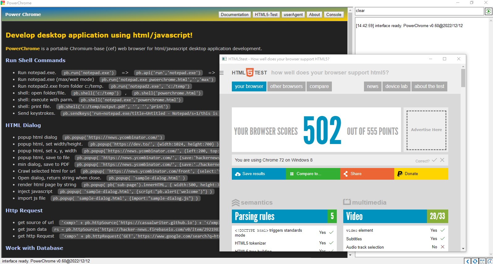

## PowerChrome for HTML/javascript application

PowerChrome is a portable chromimum-base (cef) web browser for html/javascript desktop application development.

PowerChrome provides a natual approach for html/javascript application development. It enabled HTML page for the 
accessibility of window shell / file system / database, and also provide additional application support 
by **PowerChrome-Javascript-Interface** (run in **sync mode**)

Example of PowerChrome-Javascript-Interface:

* Call notepad.exe ``pb.run('notepad.exe')``
* Eexecute file ``pb.shell('calc.exe')``
* Copy File  ``pb.fileCopy( sourceFile, targetFile )``
* Connect to oracle database ``pb.dbConnect( 'O90', dbParm, dbServer, logID, logPass )``
* Run SQL query (sync mode) ``rsStr = pb.dbQuery( 'select * from tablename' )``
* Run SQL query, and convert to json. ``rs = JSON.parse( pb.dbQuery( sql ) )``
* Get HTML source (sync mode) ``rs = pb.httpSource('https://hacker-news.firebaseio.com/v0/item/160705.json')`` 
* Popup html dialog ``pb.popup( 'sample-dialog.html', {width:1024,height:700} )``

#### Features

* Portable, no installation.
* Chromimum-base, may use Chrome/Chromimum for testing/debug.
* HTML as application. Javascript ES6 for programming.
* API run in **sync mode**. no callback, no promise object.
* Work with Powerbuilder for advanced functionality.
* Simple console support.
* Cloud-App Enabled.

### Get Started

Please download [powerchrome-0.60-with-runtime.zip](download/powerchrome-0.60-with-runtime.zip) 
and unzip the all-in-one package. Run powerchrome.exe.

`powerchrome.html` will be loaded to demonstrate how PowerChrome work with html desktop application.



### Application Startup

Powerchrome loads the startup page by the following sequence:

1. commandline options: `/app={startup.html}`
2. ini config at [system] section: `start={startup.html}`
3. `index.html` 
4. `powerchrome.html`

After page loaded, `powerchrome.js` will be imported to initialize interface, then call js function `onPageRead()`

To start coding, just simply create ``index.html`` and write your code in any text editor


### Files & Deployment

Powerchrome is a single execution file (powerchrome.exe), only `powerchrome.exe, powerchrome.js` 
and `Powerbuilder-Runtime` are requried. The other files are options or depends on usage.

File Name       | Description
----------------|------------------------
powerchrome.exe | Powerchrome progam 
powerchrome.ini | ini config file (optional, recommeded for development only)
powerchrome.js  | javascript interface
powerchrome.html| default html program. it is API quick reference 
powerchrome.pbl | source code of Powerbuilder (2019R3)
sample.mdb      | sample database (MS Access)
sample-dialog.html | sample html dialog 
sample-dialog.js  | sample javascript for html dialog 


### Command Line Options

``powerchrome.exe /app={startup.html} /fullscreen /script={interface.js} /save={name.html} /save={name.pdf} /select={selector}``    

* specify application startup page by ``/app={startup.html}`` or ``/url={startup.html}``
* open application in fullscreen ``/fullscreen`` or ``/kiosk``
* use customized interface script by ``/script={interface.js}``
* crawl page by css-selector, and save to html file ``/ulr={link} /save={name.html} /css=selector``
* print page to pdf file ``/ulr={link} /save={name.pdf}``


### Compare with Powerpage

PowerChrome is rewritten based on same design idea of [Powerpage](https://github.com/casualwriter/powerpage) 
with significant improvement.

| Comparison       | PowerChrom        | PowerPage
|------------------|-----------------|----------
| Web Engine       | Chromimum         | IE 11
| Installation     | portable          | portable
| Package Size     | 170M              | 14M
| API (javascript) | sync mode         | async mode
| Developed By     | powerbuilder 2019R3 | powerbuilder 10.5
| Capability       | all purposes        |  simple application


### Cloud Mode and Security

Powerchrome will run in **cloud mode** when the startup link start with `https://` or `https://`. 

In cloud mode, **PowerChrome-Javascript-Interface** is available for the url in same domain. 

for example, run chromechrome.exe for web-application:

```
powerchrome.exe /app=https://casualwriter.github.io/powerchrome/powerchrome.html

```

API will only available for url start with ``https://casualwriter.github.io/powerchrome/``.
if navigate to another domain, powerchrome.exe just like normal chromimum browser.


### To Do List

* documentation - Get Started
* documentation - API 
* documentation - Development Guide
* pb.datawindow(elementID, parm, action) action:=preview|print|form|report
* pb.encode(text, manner), pb.decode(text,manner)
* local application - markdown editor, web crawler
* cloud application - oracle schema, oracle helper, db-reporting

### History

2022/12/01, release version v0.56
2022/12/09, release v0.60, implement security for cloud mode.

